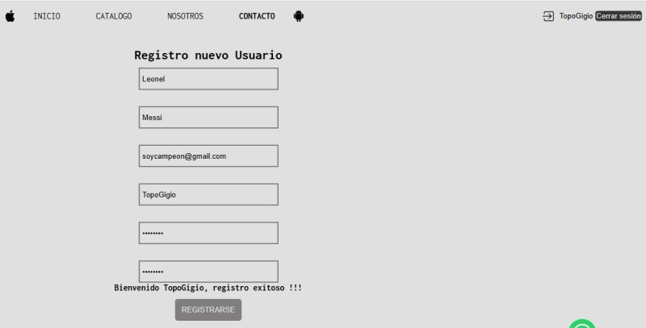
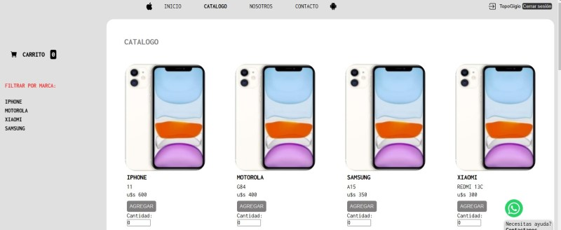
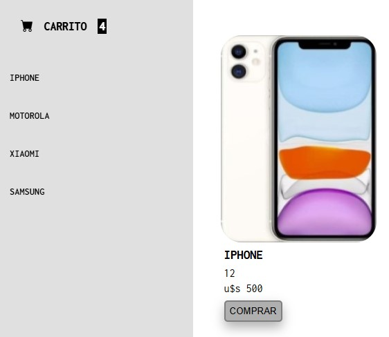
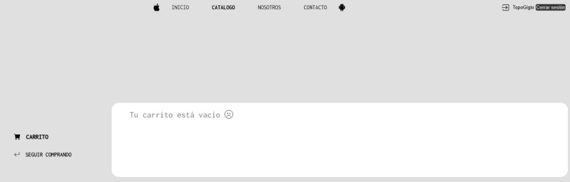
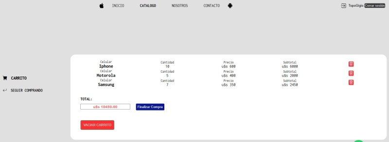
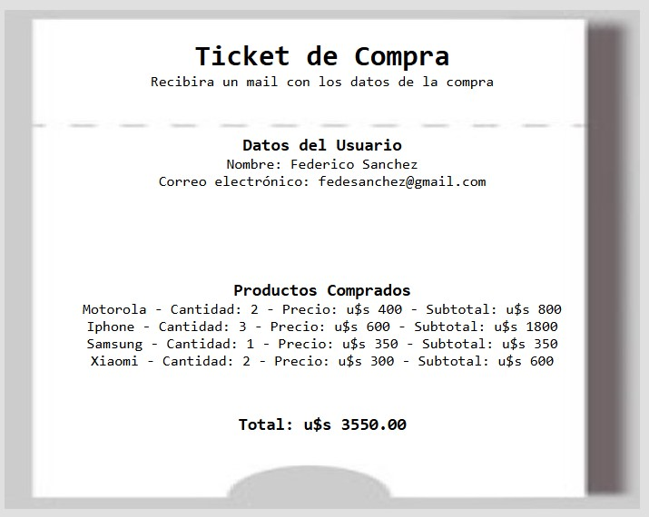

Una web dedicada a la venta y distribución de celulares. En la misma podras acceder a las últimas novedades, nuestro catálogo de productos, conocer más sobre nosotros y nuestro equipo, y finalmente contactarnos por cualquier consulta.

### Estructura del Desarrollo

 

1. Inicio
2. Catálogo
3. Carrito
4. Ticket
5. Sobre nosotros
6. Contacto
7. Registro
8. Construcción

### Herramientas utilizadas

 

    <table>
        <tr>
            <td align="center">
                
                
 <b>HTML 5</b> 
                
            </td>
            <td align="center">
                
                
 <b>CSS 3</b> 

            </td>
           <td align="center">
                
                
 <b>Javascript</b> 
      
            </td>
        </tr>
    </table>

 

### Opciones de navegación con DOM 

 

1. Registro de usuario (En esta sección se debe acceder antes de finalizar una compra)

 

2. Ver Catálogo 

 

3. Incremento de número en Carrito cuando se utiliza el botón comprar

 

4. Carrito de compras vacío 

 

5. Carrito de compras con ítems

 

6. Ticket de compra (ejemplo)

 

